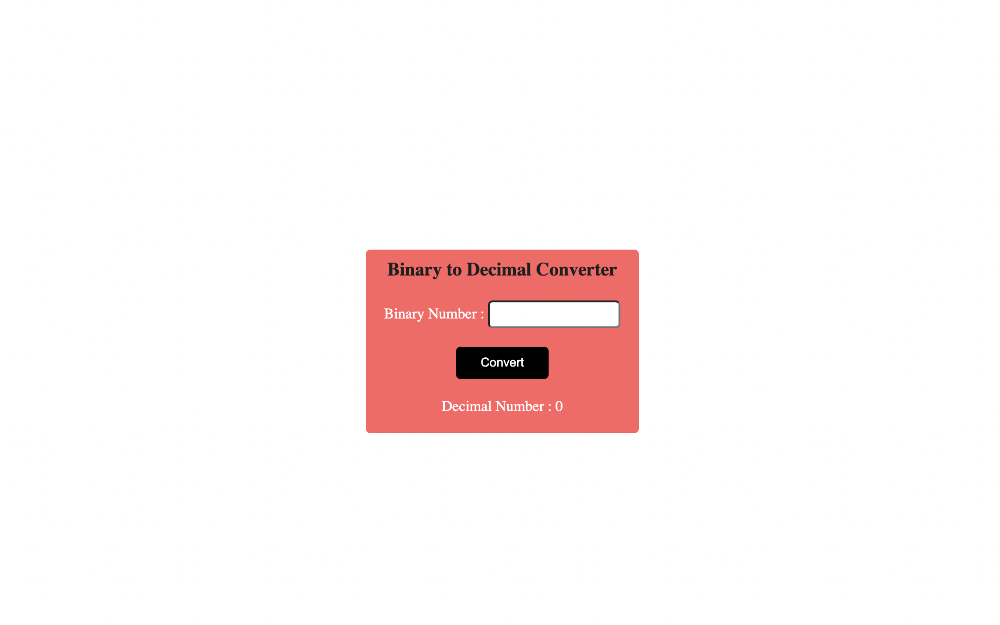
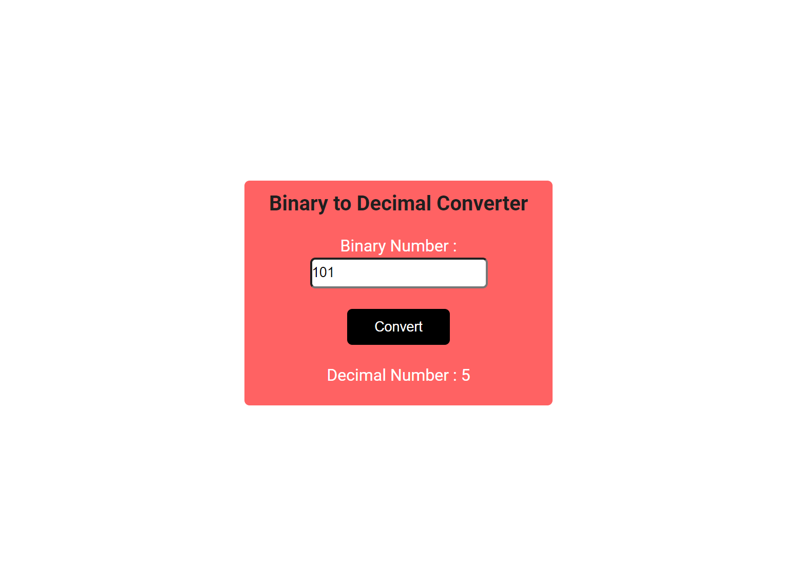

# JS ASSIGNMENT 6

Binary to decimal conversion

### default:

### output:

It took me around 1.5 hours to complete it.

Technology Used:

- HTML
- CSS
- JAVASCRIPT

Live Demo: [Link](https://js-binary-to-decimal.netlify.app/)
